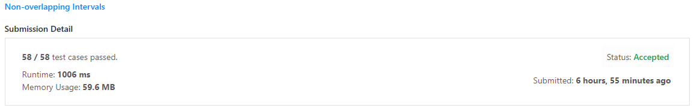
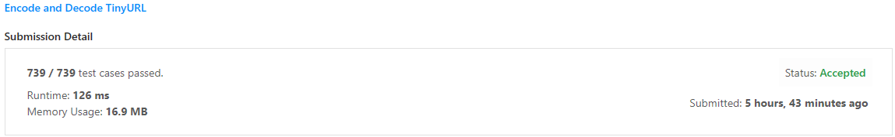

# Greed Exercícios Resolvidos

**Conteúdo da Disciplina**: Algoritmos ambiciosos<br>

## Alunos
| Matrícula  | Aluno                                                        |
| ---------- | ------------------------------------------------------------ |
| 19/0089601 | [João Lucas Pinto Vasconcelos](https://github.com/HacKairos) |

## Sobre 
Meu projeto se trata sobre a resolução de alguns exercícios no juiz online LeetCode utilizando os algoritmos apresentados no decorrer das aulas de Algoritmos ambiciosos, os exercícios escolhidos foram [**Non-overlapping Intervals**](https://leetcode.com/problems/non-overlapping-intervals/description/), [**Minimum Number of Arrows to Burst Balloons**](https://leetcode.com/problems/minimum-number-of-arrows-to-burst-balloons/description/), [**Maximum Length of Pair Chain**](https://leetcode.com/problems/maximum-length-of-pair-chain/description/) e [**Encode and Decode TinyURL.**](https://leetcode.com/problems/encode-and-decode-tinyurl/description/)


## Screenshots
### Resultados
#### [**Non-overlapping Intervals**](https://leetcode.com/problems/non-overlapping-intervals/description/)

#### [**Minimum Number of Arrows to Burst Balloons**](https://leetcode.com/problems/minimum-number-of-arrows-to-burst-balloons/description/)

#### [**Maximum Length of Pair Chain**](https://leetcode.com/problems/maximum-length-of-pair-chain/description/)

#### [**Encode and Decode TinyURL**](https://leetcode.com/problems/encode-and-decode-tinyurl/description/)


## Instalação 
**Linguagem**: Python<br>
Apenas será necessário criar um arquivo de entrada de acordo com os exemplos de cada exercício e utilizar o seguinte comando:

```bash
python arquivo.py < entrada.txt
```

## Soluções
### [**Non-overlapping Intervals**](Src/435.py/)

```python
class Solution(object):
    def eraseOverlapIntervals(self, intervals):
        # Inicializa o fim do último intervalo não sobreposto como 0 e a contagem de intervalos sobrepostos como 0.
        fim, count = float('-inf'), 0

        # Ordena os intervalos pelo término.
        for comeco, proxFim in sorted(intervals, key=lambda x: x[1]):
            # Se o início do intervalo atual é maior ou igual ao fim do último intervalo não sobreposto,
            # atualiza o fim do último intervalo não sobreposto.
            if comeco >= fim: 
                fim = proxFim
            else: 
                # Caso contrário, incrementa a contagem de intervalos sobrepostos.
                count += 1

        # Retorna a contagem de intervalos sobrepostos.
        return count
```
#### Explicação
Nesta solução, eu utilizei o algoritmo de agendamento de intervalos (Interval Scheduling). Primeiramente, eu ordeno os intervalos em ordem crescente de acordo com o final de cada intervalo. Após isso, eu inicializo a variável `fim` com `-infinito` e a variável `count` como 0.

Em seguida, eu itero sobre os intervalos ordenados. Se o início do intervalo atual for maior ou igual ao fim do último intervalo não sobreposto, eu atualizo `fim` para ser o fim do intervalo atual. Caso contrário (ou seja, se os intervalos se sobrepõem), eu incremento `count`.

Finalmente, eu retorno `count`, que representa o número mínimo de intervalos sobrepostos que precisam ser removidos.

### [**Minimum Number of Arrows to Burst Balloons**](Src/452.py)

```python
class Solution(object):
    def findMinArrowShots(self, points):
        # Obtém o número de pontos
        n = len(points)
        
        # Se houver 1 ou nenhum ponto, retorna o número de pontos
        if n <= 1:
            return n

        # Ordena os pontos pela coordenada final
        points.sort(key=lambda x: x[1])
        
        # Inicializa a lista de pontos selecionados com o primeiro ponto
        selecionados = [points[0]]
        
        # Itera sobre os pontos restantes
        for i in range(1, n):
            # Se o início do ponto atual é maior que o fim do último ponto selecionado,
            # adiciona o ponto atual à lista de pontos selecionados
            if points[i][0] > selecionados[-1][1]:
                selecionados.append(points[i])

        # Retorna o número de pontos selecionados
        return len(selecionados)

```

#### Explicação
Na segunda solução, eu utilizei o algoritmo de agendamento de intervalos (Interval Scheduling). Primeiramente, eu ordeno os intervalos em ordem crescente de acordo com o final de cada intervalo. Após isso, eu inicializo a lista `selecionados` com o primeiro ponto.

Após isso eu itero sobre os pontos restantes. Se o início do ponto atual for maior que o fim do último ponto selecionado (ou seja, os intervalos não se sobrepõem), eu adiciono o ponto atual à lista `selecionados`.

Então eu retorno o número de pontos na lista `selecionados`, que representa o número mínimo de flechas necessárias para estourar todos os balões.

### [**Maximum Length of Pair Chain**](Src/646.py)

```python
class Solution(object):
    def findLongestChain(self, pairs):
        # Ordena os pares pela extremidade final.
        parsOrdenados = sorted(pairs, key=lambda x: x[1])

        # Se a lista de pares está vazia, retorna 0.
        if len(parsOrdenados) == 0:
            return 0

        # Inicializa o fim do último par não sobreposto como o fim do primeiro par na lista ordenada e a contagem da cadeia como 1.
        fimAtual, comprimento = parsOrdenados[0][1], 1

        # Itera sobre cada par na lista ordenada.
        for par in parsOrdenados:
            # Se o fim do último par não sobreposto é menor que o início do par atual,
            # incrementa a contagem da cadeia e atualiza o fim do último par não sobreposto.
            if fimAtual < par[0]:
                comprimento += 1
                fimAtual = par[1]

        # Retorna a contagem da cadeia, que representa o comprimento da cadeia mais longa de pares.
        return comprimento
```
#### Explicação

Na terceira solução, eu implementei o algoritmo de agendamento de intervalos (Interval Scheduling) para resolver o problema de encontrar a cadeia mais longa de pares que podem ser formados.

Primeiramente, eu ordeno os pares em ordem crescente de acordo com o final de cada par. Após isso, eu verifico se a lista de pares está vazia. Se estiver, eu retorno 0.

Em seguida, eu inicializo `fimAtual` com o final do primeiro par na lista ordenada e `comprimento` como 1, representando o comprimento da cadeia.

Depois disso, eu itero sobre cada par na lista ordenada. Se `fimAtual` for menor que o início do par atual (ou seja, os pares não se sobrepõem), eu incremento `comprimento` e atualizo `fimAtual` para ser o final do par atual.

Finalmente, eu retorno `comprimento`, que representa o comprimento da cadeia mais longa de pares que podem ser formados.

### [**Encode and Decode TinyURL**](Src/535.py)

```python
import heapq

# Definindo a estrutura de um nó da árvore de Huffman
class Node:
    def __init__(self, char, freq, left=None, right=None):
        self.char = char
        self.freq = freq
        self.left = left
        self.right = right

# Função para criar a tabela de Huffman a partir da árvore de Huffman
def criar_tabela_huffman(node, codificacao, tabela_huffman):
    # Se o nó é uma folha (não tem filhos), adiciona a codificação na tabela de Huffman
    if node.left is None and node.right is None:
        tabela_huffman[node.char] = codificacao
        return
    # Se o nó não é uma folha, continua a construção da tabela para os filhos do nó
    criar_tabela_huffman(node.left, codificacao + "0", tabela_huffman)
    criar_tabela_huffman(node.right, codificacao + "1", tabela_huffman)

# Função para calcular as frequências dos caracteres no texto
def calcular_frequencias(texto):
    frequencias = {}
    for char in texto:
        if char not in frequencias:
            frequencias[char] = 0
        frequencias[char] += 1
    return frequencias

# Função para construir a árvore de Huffman a partir das frequências dos caracteres
def construir_arvore_huffman(frequencias):
    fila_prioridade = [Node(char, freq) for char, freq in frequencias.items()]
    heapq.heapify(fila_prioridade)
    while len(fila_prioridade) > 1:
        a = heapq.heappop(fila_prioridade)
        b = heapq.heappop(fila_prioridade)
        heapq.heappush(fila_prioridade, Node(None, a.freq + b.freq, a, b))
    return fila_prioridade[0]

class Codec:
    def __init__(self):
        self.tabela_huffman = {}
        self.raiz = None

    # Função para codificar o texto usando a árvore de Huffman
    def encode(self, longUrl):
        frequencias = calcular_frequencias(longUrl)
        self.raiz = construir_arvore_huffman(frequencias)
        criar_tabela_huffman(self.raiz, "", self.tabela_huffman)
        return "".join(self.tabela_huffman[char] for char in longUrl)

    # Função para decodificar o texto usando a árvore de Huffman
    def decode(self, shortUrl):
        texto_decodificado = []
        node = self.raiz
        for bit in shortUrl:
            if bit == '0':
                node = node.left
            else:
                node = node.right
            if node.left is None and node.right is None:
                texto_decodificado.append(node.char)
                node = self.raiz
        return "".join(texto_decodificado)
```
#### Explicação
Para última solução, eu implementei o algoritmo de Huffman para codificar e decodificar textos.

Primeiramente, eu defino a estrutura de um nó da árvore de Huffman, que contém um caractere, uma frequência e referências para os nós filhos à esquerda e à direita.

Em seguida, eu crio uma função para calcular as frequências dos caracteres no texto. Para cada caractere no texto, eu incremento sua frequência na tabela de frequências.

Depois disso, eu construo a árvore de Huffman usando uma fila de prioridades. Eu insiro todos os nós na fila de prioridades e então removo os dois nós com as menores frequências, criando um nó que é a soma das frequências desses dois nós. Eu repito esse processo até que reste apenas um nó na fila de prioridades, que será a raiz da árvore de Huffman.

Com a árvore de Huffman construída, eu crio a tabela de Huffman percorrendo a árvore. Para cada nó folha (que representa um caractere), eu adiciono uma entrada na tabela de Huffman com o caractere e sua codificação correspondente.

Por fim, eu defino as funções encode e decode. A função encode codifica o texto substituindo cada caractere por sua codificação na tabela de Huffman. A função decode decodifica o texto percorrendo a árvore de Huffman para cada bit no texto codificado, adicionando o caractere correspondente ao texto decodificado quando alcança um nó folha.
